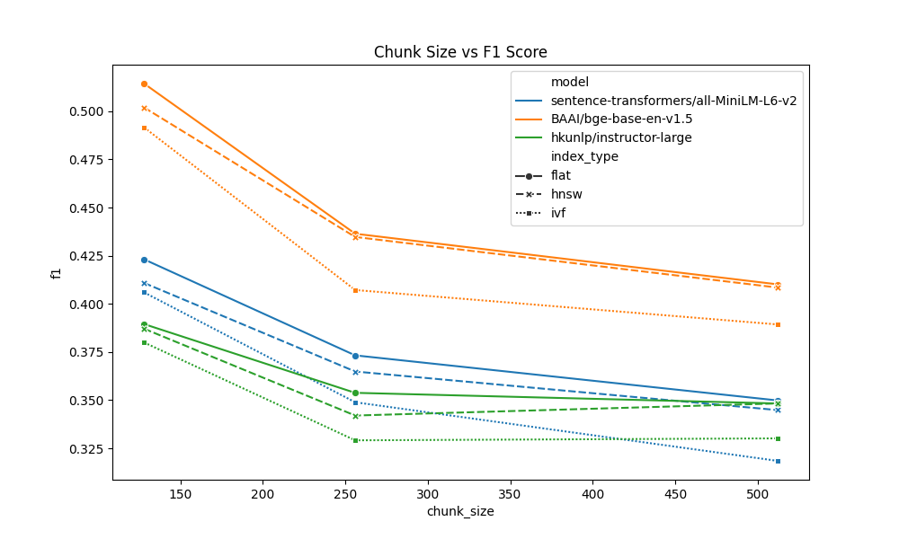
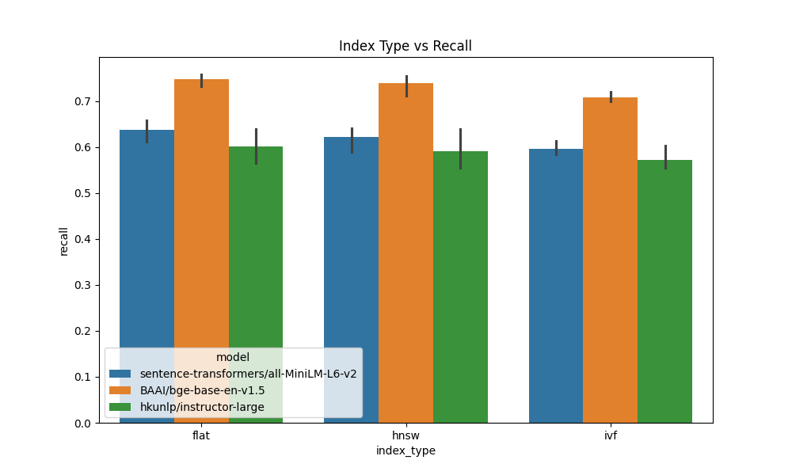
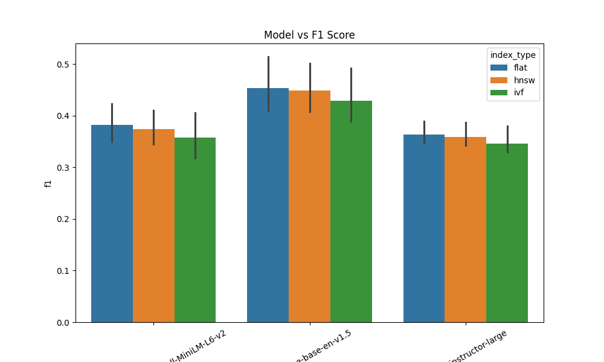

# RAGBench
Benchmarking Retrieval Pipelines for Retrieval-Augmented Generation

RAGBench is a modular benchmarking framework for evaluating dense retrieval pipelines used in Retrieval-Augmented Generation (RAG) systems.

It supports systematic experimentation across embedding models, vector search indexes, and chunking strategies while measuring retrieval quality using standard Information Retrieval metrics.

Built for researchers and engineers exploring high-performance RAG architectures.

## Highlights

• Benchmark dense retrieval pipelines for RAG systems  
• Supports multiple embedding models and FAISS index types  
• Automatic experiment runner for parameter sweeps  
• Embedding caching for faster experiments  
• Automatic visualization of benchmark results  
• Supports BEIR datasets for reproducible evaluation


## Benchmark Results

### Chunk Size vs Retrieval Quality



### Index Type vs Recall



### Model Comparison




---

# Supported Embedding Models

Current models tested:

- sentence-transformers/all-MiniLM-L6-v2
- BAAI/bge-base-en-v1.5
- hkunlp/instructor-large

These models generate vector embeddings used for similarity search.

---

# Vector Index Types

FAISS indexes supported:

| Index | Description |
|------|-------------|
| Flat | Exact nearest neighbor search |
| HNSW | Graph-based approximate nearest neighbors |
| IVF | Inverted file index for large datasets |

---

# Evaluation Metrics

RAGBench evaluates retrieval performance using:

- Precision@K
- Recall@K
- Hit Rate@K
- Mean Reciprocal Rank (MRR)
- F1 Score

---

# Dataset

Experiments are performed on the **SciFact dataset** from the BEIR benchmark.

## Quick Start

Clone the repository:

```bash
git clone https://github.com/yourusername/RAGBench.git
cd RAGBench

Create Environment

-python -m venv venv

Activate

-venv\Scripts\activate

Install dependencies:

-pip install -r requirements.txt

Run benchmark:

python main.py

```


## System Architecture

Dataset
↓
Document Chunking
↓
Embedding Model
↓
Vector Index (FAISS)
↓
Top-K Retrieval
↓
Evaluation Metrics
↓
Benchmark Results + Visualization

## Key Findings

Experiments on the SciFact dataset reveal:

• BAAI/bge-base-en-v1.5 achieves the highest F1 score  
• Smaller chunk sizes (~128 tokens) outperform larger chunks  
• Flat and HNSW indexes outperform IVF for smaller datasets  

These results highlight the importance of embedding model selection and chunking strategy when designing RAG pipelines.

## Future Work

• Cross-encoder reranking  
• Hybrid retrieval (BM25 + dense retrieval)  
• Support for additional BEIR datasets  
• Integration with LLM generation pipelines  
• Large-scale vector databases (Milvus, Qdrant)


